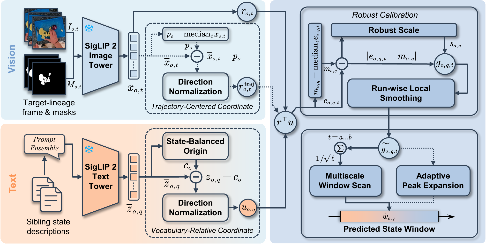

<div align="center">
<h1>Déjà Cue: Localizing States in Object Histories via Vocabulary-Relative Coordinates</h1>

<p align="center">Haofan Cao · Zhichao You · Yunkai Yang · Liang Guo · Jie Wang · Chongshou Li</p>

<p align="center">
  <a href="https://arxiv.org/abs/2608.02044"></a>
  <a href="https://github.com/HaofanCao/DejaCue"></a>
  <a href="https://huggingface.co/papers/2608.02044"></a>
  <a href="LICENSE"></a>
  
  
</p>

<p align="center">
  <a href="#abstract">📄 Abstract</a> ·
  <a href="#news">🔥 News</a> ·
  <a href="#method">🧠 Method</a> ·
  <a href="#main-result">📊 Results</a> ·
  <a href="#quick-start">🚀 Quick Start</a> ·
  <a href="#citation">📝 Citation</a>
</p>

</div>

<p align="center">
  
</p>

<p align="center"><em>Déjà Cue uses sibling state descriptions as an object-specific coordinate system for temporal state localization.</em></p>

> **Official implementation and fixed-feature evaluation release.** Given a tracked-object history and a closed, state-grouped vocabulary, Déjà Cue localizes one inclusive temporal interval for every state description without task-specific training.

## Abstract

Tracking links observations of the same object through visual change, yet cannot by itself determine when the object is empty or filled, intact or cut. We formulate identity-conditioned state-moment retrieval: given a tracked-object history and alternative state descriptions, localize an interval in which each described state holds. Absolute image-text similarity scores descriptions independently; because every visible frame depicts the same target, shared object compatibility can obscure the state evidence needed to identify the target interval. The alternatives provide the missing reference: evidence for one state should be measured against the others. We introduce Déjà Cue, a training-free framework that turns these alternatives into a vocabulary-relative coordinate system. It subtracts their state-balanced centroid from each description, calibrates frame scores, and scans multiple durations within contiguous visible runs using a frozen encoder. On 78 VOST histories, holding the temporal scan fixed and changing only the query reference nearly doubles R@1 at tIoU 0.5 from 10.3% to 20.5% and raises Top-1 tIoU from 16.0% to 21.5%. Candidate-rank analyses show that vocabulary-relative queries rank useful intervals higher within the same candidate set. Related state descriptions can therefore serve as an object-specific, query-time coordinate system for reading frozen visual representations.

<p align="right"><a href="https://arxiv.org/abs/2608.02044">Read the paper on arXiv →</a></p>

## News

- **2026.08.05** · The official code and fixed-feature evaluation assets are now open source.

## ✨ Highlights

- **A new retrieval setting.** Identity-conditioned state-moment retrieval asks when a described state holds within the visual history of one tracked object.
- **A vocabulary-relative coordinate system.** Sibling state descriptions define the query-time reference needed to suppress shared object compatibility and expose state evidence.
- **Training-free temporal localization.** Frozen SigLIP 2 features, robust per-query calibration, and a run-constrained multiscale scan require no task-specific optimization.
- **Reproducible evaluation.** The release includes fixed features, settings, reference windows, statistical rows, tests, and CPU reproduction commands.

## 🧭 At a Glance

|  | Details |
| --- | --- |
| Input | A tracked-object history, observed-frame features, and sibling state descriptions |
| Output | One inclusive interval per description |
| Primary evaluation | 78 VOST histories, 156 states, and 312 descriptions |
| Representation | Frozen 768-dimensional SigLIP 2 features |
| Default method | Training-free, run-constrained, 33-duration multiscale scan |
| Reproduction | CPU; no raw video, masks, encoder weights, or checkpoints required |

## Method

For each object history, Déjà Cue:

1. averages descriptions within each state and then weights states equally to form a state-balanced vocabulary centroid;
2. subtracts that centroid from each description embedding and normalizes the residual into a vocabulary-relative query direction;
3. calibrates each query's framewise responses with the observed-frame median and normalized median absolute deviation; and
4. smooths and searches only inside contiguous observed runs, using a fixed multiscale duration schedule and never crossing a visibility gap.

The repository also contains matched coordinate ablations, robustness and diagnostic experiments, VOST cohort validators, SigLIP 2 feature extraction, and native training and evaluation paths for eight temporal decoders.

## Main Result

The primary matched scan changes only the query coordinate. Frozen features, calibration, observed runs, candidate windows, scoring, and tie rules are held fixed.

| Query coordinate | R@1 at tIoU 0.3 | R@1 at tIoU 0.5 | Top-1 tIoU |
| --- | ---: | ---: | ---: |
| Absolute | 23.1 | 10.3 | 16.0 |
| **Vocabulary-relative** | **30.4** | **20.5** | **21.5** |
| Difference | **+7.4** | **+10.3** | **+5.5** |

Values are percentages over 78 VOST source components. For R@1 at tIoU 0.5, the paired difference has a 95% interval of [4.5, 16.0] percentage points and Holm-adjusted p = .004.

This table isolates the coordinate effect; it is not a general leaderboard claim. The absolute max-frame baseline reaches 23.0 Top-1 tIoU, the small seven-history held-out results are mixed, and no learned-decoder comparison is significant after Holm correction. See [Reproducing the Results](docs/reproducing-results.md) for the commands, outputs, and limitations of each evaluation.

## Quick Start

Python 3.10 or newer is required. Clone the complete repository and use an editable install. The commands use the included `data/`, `configs/`, `scripts/`, and `third_party/` directories.

```bash
git clone https://github.com/HaofanCao/DejaCue.git
cd DejaCue
python -m venv .venv
source .venv/bin/activate
python -m pip install --upgrade pip
python -m pip install -e ".[test]"
python scripts/reproduce_main.py --device cpu
```

On Windows PowerShell, activate with `.\.venv\Scripts\Activate.ps1`. The primary command reproduces all 2,184 selected-window results and writes `results/main_reproduction.json`.

Run every fixed-feature evaluation, recalculate the statistical results, verify the download, and run the tests with:

```bash
python scripts/reproduce_all.py --device cpu
```

## 🧪 Reproduce a Result

| Goal | Command |
| --- | --- |
| Run one small programmatic example | `python examples/quick_retrieval.py` |
| Verify the downloaded files and data | `python scripts/verify_package.py` |
| Inspect the VOST cohort | `python scripts/inspect_vost_cohort.py` |
| Reproduce the seven-method VOST comparison | `python scripts/reproduce_main.py --device cpu` |
| Reproduce adaptive peak, prompts, normalization, ranking, and duration analyses | `python scripts/reproduce_extended.py --device cpu` |
| Reproduce the seven-history coordinate study | `python scripts/reproduce_seven_history.py --device cpu` |
| Recalculate learned-decoder statistics | `python scripts/check_reference_results.py` |
| Recalculate robustness results | `python scripts/check_robustness_results.py` |
| Run all tests | `python -m pytest -q` |

The installed `deja-cue` command provides shortcuts for the tasks above. For example, `deja-cue main --device cpu` runs the primary comparison from an editable checkout.

### Reproduction Scope

| Workflow | What you need | What it does |
| --- | --- | --- |
| Reproduce reported results | Included features, settings, references, and statistical rows | Recreates the retrieval windows, metrics, and statistical summaries |
| Recreate features or annotations | RGB, masks, annotation files, model files, or experiment inputs | Generates new features or evaluation files and records the inputs used |
| Train learned decoders | Included five-history development features | Trains 8 decoders with 3 seeds on CUDA |
| Measure runtime | Included features on the executing hardware | Measures latency on the current machine |

The CPU workflow does not repeat human annotation, encoder execution, decoder optimization, or the paper's RTX 4090 timing measurement.

## 🗂️ Data

The repository includes everything needed to reproduce the fixed-feature results. It contains the 78-history VOST evaluation, prompt variants, a five-history development set, a seven-history evaluation, fixed protocol files, exact reference windows, and the rows used for the reported statistical analyses. NumPy archives are loaded with pickle disabled and checked for format, alignment, finiteness, and normalization.

A companion Hugging Face dataset repository mirrors `data/` for data-centric discovery and selective download. Native RGB, target-lineage masks, pretrained encoder weights, learned checkpoints, the two complete VOST annotation passes, and resolved framewise consensus are not redistributed. The release instead provides protocol code, cohort information, validation scripts, and the agreement and sensitivity summaries.

Read the [data guide](docs/data.md), [data layout](data/README.md), and [data terms](DATA_LICENSE.md) before reuse.

## 📚 Documentation

| Guide | Use it for |
| --- | --- |
| [Installation](docs/installation.md) | Environments, CUDA determinism, extraction, training, and timing |
| [Data](docs/data.md) | Data sources, file formats, included files, exclusions, and limitations |
| [Evaluation](docs/evaluation.md) | Commands, expected outputs, and reference files |
| [Reproducibility](docs/reproducibility.md) | Complete experimental procedure and implementation details |
| [Reproducing the Results](docs/reproducing-results.md) | Commands for each result and guidance on how to interpret them |

## 🧱 Repository Structure

```text
deja-cue/
  assets/                     Paper visuals used in this README
  configs/                    Retrieval, encoder, decoder, and experiment settings
  data/                       Fixed features, protocols, and reference results
  deja_cue/                   Retrieval, evaluation, learning, and experiments
  docs/                       Installation, data, evaluation, and protocol guides
  examples/                   Small programmatic examples
  scripts/                    Reproduction, validation, training, and generation CLIs
  tests/                      Unit, data, and end-to-end tests
  third_party/                Pinned decoder sources and original licenses
  MANIFEST.json               File list with SHA-256 checksums
```

## 🧩 Learned Decoders

The learned comparison covers Moment-DETR, QD-DETR, EaTR, CG-DETR, UVCOM, TR-DETR, TaskWeave, and Sim-DETR with seeds 3407, 3408, and 3409. The repository contains the frozen five-history development inputs and native training, checkpoint metadata, and evaluation code. Generated checkpoints are outputs, not repository inputs. Exact commands and deterministic CUDA settings are in the [reproducibility protocol](docs/reproducibility.md#6-native-learned-decoders).

## 🤝 Contributing

Bug reports and focused improvements are welcome through GitHub Issues and pull requests. Scientific changes should preserve the documented method and evaluation settings and include tests. Do not include credentials, private paths, or restricted source media in public issues or pull requests.

## ⚖️ License

Original project code is released under the [Apache License 2.0](LICENSE). Bundled third-party sources retain their original license files under [`third_party/`](third_party/). Data and derived feature assets are governed separately by [DATA_LICENSE.md](DATA_LICENSE.md).

## 📖 Citation

If you use Déjà Cue in your research, please cite the official arXiv record:

```bibtex
@misc{cao2026dejacue,
  title         = {Déjà Cue: Localizing States in Object Histories via Vocabulary-Relative Coordinates},
  author        = {Haofan Cao and Zhichao You and Yunkai Yang and Liang Guo and Jie Wang and Chongshou Li},
  year          = {2026},
  eprint        = {2608.02044},
  archivePrefix = {arXiv},
  primaryClass  = {cs.CV},
  url           = {https://arxiv.org/abs/2608.02044}
}
```

**Paper:** [**arXiv:2608.02044**](https://arxiv.org/abs/2608.02044)
